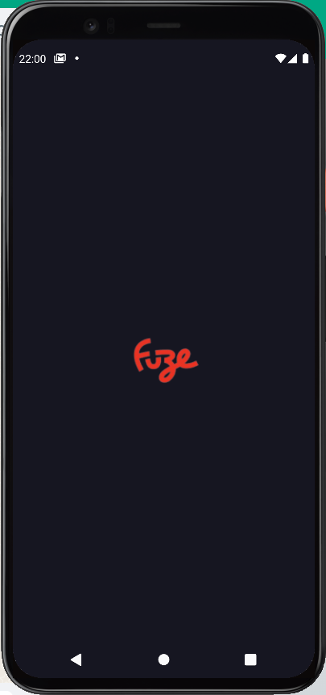
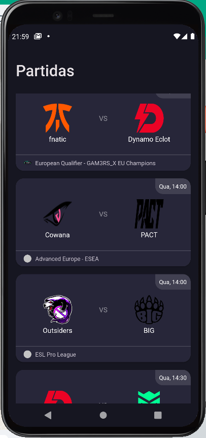
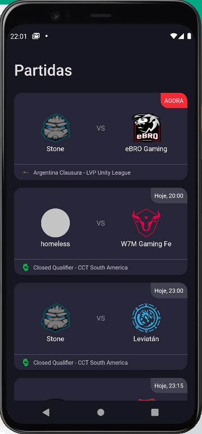
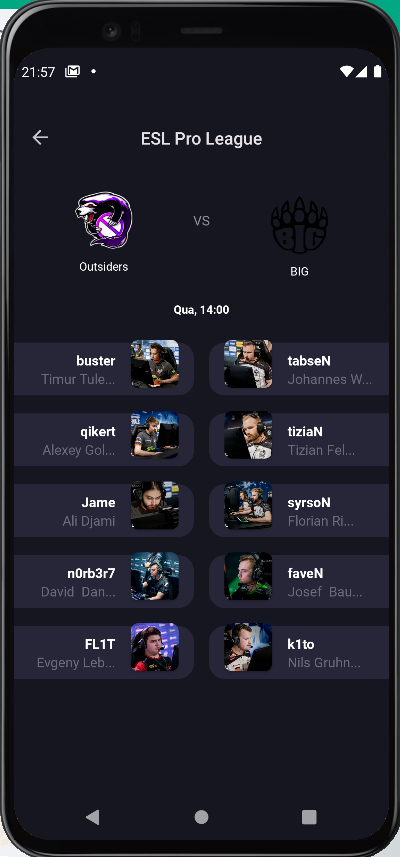

<h1 align="center">CSTV</h1>
<p align="center">Aplicação de exemplo que faz chamadas à api da PandaScore para exibição de partidas e detalhes de partidas do game csgo.<br></p>


## 👨🏾‍💻 Rodando o App

Faça um clone desse repositório. Aguarde o download das bibliotecas. E rode o mesmo em um simulador
ou em um aparelho fisico. Também é necessário criar uma conta na PandaScore para ter uma chave para
alterar as variáveis de build. O projeto tem 3 Variáveis de build que podem ser acessadas no
build.gradle a nível de app, sendo elas:

```kotlin
    ACCESS_TOKEN // STRING Token de acesso PandaScore
BASE_URL // STRING Url Base para api solicitada (CSGO)
PAGINATION_SIZE // INTEGER Tamanho da paginação da tela inicial da listagem de partidas
```

## 👨🏾‍💻 Branchs

O projeto segue um conceito chamado
git-flow. <a href="https://platform.deloitte.com.au/articles/semantic-versioning-with-conventional-commits">
saiba mais</a>

<li> <strong> Main branch</strong>, branch estável corrente </li>
<li> <strong> Develop branch</strong>, versão em desenvolvimento </li>
<li> <strong> Feature branch</strong>, para novas funcionalidades </li>
<li> <strong> Fix branch</strong>, para correção de bugs </li>

## 👨🏾‍💻 Conhecendo o App

<div>
    
    
    
    
</div>

- [x] Splash Screen com logo
- [x] Listagem de partidas de CS de forma paginada.
- [x] Exibição de detalhes da partida
- [x] Exibição de imagens e nome de players da partida
- [x] Utilização de um conceito de arquitetura MVVM
- [x] Applicação responsível

## 🛠 Libs

```kotlin
//core dependency
implementation 'androidx.navigation:navigation-fragment-ktx:2.5.1'
implementation 'androidx.navigation:navigation-ui-ktx:2.5.1'

//Lifecycle
implementation "androidx.lifecycle:lifecycle-viewmodel-ktx:2.5.1"
implementation "androidx.lifecycle:lifecycle-livedata-ktx:2.5.1"
implementation "androidx.lifecycle:lifecycle-runtime-ktx:2.5.1"

//Pagination
implementation "androidx.paging:paging-runtime:3.1.1"

//Retrofit
implementation "com.squareup.retrofit2:retrofit:2.9.0"
implementation "com.squareup.retrofit2:converter-gson:2.9.0"

//Http
implementation "com.squareup.okhttp3:okhttp:5.0.0-alpha.2"

//DI
implementation "io.insert-koin:koin-android:3.1.6"

//GLIDE
implementation "com.github.bumptech.glide:glide:4.13.2"
```

## 👤 Author

<h3> <b> Ricardo Souza ♥ </b></h3>

<li> Github: <a href="https://github.com/Riicksouzaa">Ricardo Souza</a> </li>
<li> Linkedin: <a href="https://www.linkedin.com/in/ricardo-a-souza/">Ricardo Souza</a> </li>